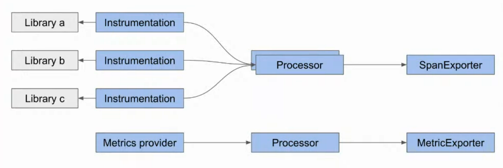
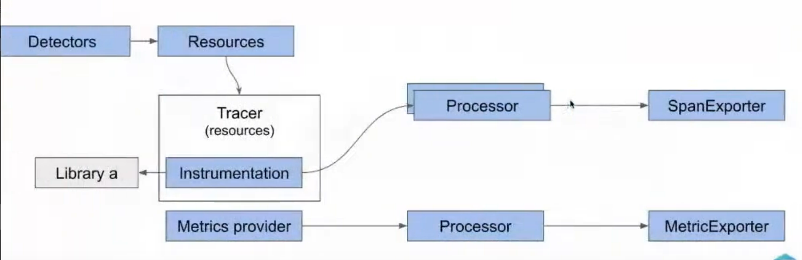
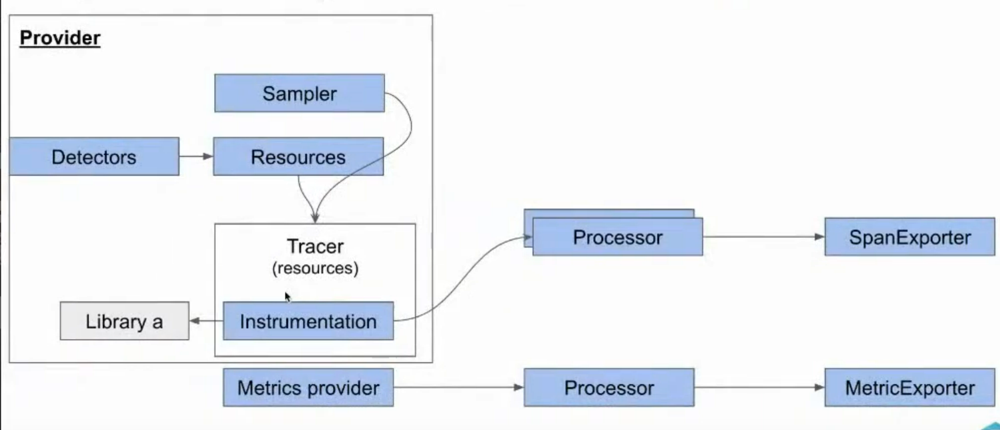

# Intro

## OpenTelemetry là gì?

   - OpenTelemetry là một tập hợp các tool, API, và SDK mã nguồn mở được thiết kế để thu thập, xử lý và xuất dữ liệu telemetry (đo lường từ xa) từ các ứng dụng và hệ thống. Nó cung cấp một cách chuẩn hóa để thu thập ba loại dữ liệu chính: traces, metrics, và logs.
   - OpenTelemetry hỗ trợ nhiều ngôn ngữ lập trình (như Java, Python, Go, JavaScript, v.v.) và tích hợp với nhiều hệ thống giám sát như Prometheus, Jaeger, Zipkin, hoặc các nền tảng thương mại như Datadog, New Relic.

## Benefit

   - Chuẩn hóa thu thập dữ liệu telemetry:
     - OpenTelemetry cung cấp một tiêu chuẩn thống nhất để thu thập và xuất dữ liệu từ nhiều nguồn khác nhau, giảm sự phụ thuộc vào các công cụ độc quyền.
     - Hỗ trợ tích hợp dễ dàng với các hệ thống giám sát khác nhau thông qua định dạng xuất chuẩn (như OTLP - OpenTelemetry Protocol).
   - Tăng khả năng quan sát (Observability):

     - Traces: Giúp theo dõi luồng thực thi của yêu cầu qua các dịch vụ, xác định điểm nghẽn hoặc lỗi trong hệ thống phân tán.
     - Metrics: Cung cấp số liệu về hiệu suất hệ thống (CPU, bộ nhớ, độ trễ, tỷ lệ lỗi, v.v.).
     - Logs: Ghi lại các sự kiện chi tiết để phân tích và gỡ lỗi.

   - Hỗ trợ hệ thống phân tán:

     - OpenTelemetry đặc biệt hữu ích trong các môi trường microservices, nơi các dịch vụ chạy trên nhiều nền tảng và công nghệ khác nhau. Nó giúp theo dõi và phân tích các tương tác phức tạp giữa các dịch vụ.

   - Giảm chi phí và sự phức tạp:
     - Thay vì sử dụng nhiều công cụ giám sát riêng lẻ, OpenTelemetry cung cấp một giải pháp thống nhất, giảm chi phí tích hợp và bảo trì.
     - Hỗ trợ các nhà cung cấp dịch vụ khác nhau, giúp doanh nghiệp tránh bị khóa vào một nhà cung cấp cụ thể (vendor lock-in).
   - Tích hợp dễ dàng:
     - OpenTelemetry cung cấp các thư viện tự động (auto-instrumentation) cho nhiều framework và ngôn ngữ, giảm thời gian và công sức để triển khai giám sát.
     - Tích hợp với các công cụ DevOps phổ biến như Kubernetes, Docker, và các nền tảng đám mây (AWS, Azure, GCP).
   - Khả năng mở rộng và linh hoạt:
     - OpenTelemetry có thể xử lý khối lượng dữ liệu lớn trong các hệ thống quy mô lớn.
     - Cho phép tùy chỉnh việc thu thập dữ liệu, như lấy mẫu (sampling) để giảm tải hoặc tập trung vào các dữ liệu quan trọng.
   - Hỗ trợ phân tích và gỡ lỗi:
     - Cung cấp thông tin chi tiết về hiệu suất và lỗi, giúp các nhóm phát triển nhanh chóng xác định và khắc phục sự cố.
     - Hỗ trợ phân tích nguyên nhân gốc rễ (root cause analysis) trong các hệ thống phức tạp.

## Trace

- Trace đại diện cho hành trình của một yêu cầu (request) khi nó di chuyển qua các dịch vụ trong một hệ thống phân tán. Trace bao gồm các span, là các đơn vị công việc nhỏ hơn, ghi lại thông tin về thời gian, trạng thái, và các sự kiện trong quá trình xử lý yêu cầu.
- Logs trong trace: Mỗi span trong trace có thể được gắn với các logs (nhật ký) để cung cấp thêm thông tin chi tiết về những gì xảy ra tại một điểm cụ thể trong quá trình xử lý. Ví dụ:
  - Một span đại diện cho một lời gọi API có thể chứa log về lỗi xảy ra hoặc thông tin gỡ lỗi (debug information).
  - Logs này được gắn trực tiếp vào span thông qua các thuộc tính (attributes) hoặc sự kiện (events) trong OpenTelemetry, giúp liên kết bối cảnh (context) của trace với thông tin chi tiết từ log.

## Log

- Trong OpenTelemetry, các logs có thể được cấu hình để chứa trace context (bối cảnh theo dõi), chẳng hạn như Trace ID và Span ID, giúp liên kết một log cụ thể với một trace hoặc span cụ thể.
- Trace ID là định danh duy nhất cho toàn bộ trace, trong khi Span ID xác định một bước cụ thể trong trace.
- Khi một log được tạo ra, nó có thể bao gồm các trường metadata (như trace_id và span_id) để chỉ ra nó thuộc về trace hoặc span nào.

```text
  Ví dụ: Nếu một dịch vụ ghi log một lỗi, log đó có thể chứa trace_id để liên kết với trace của yêu cầu gây ra lỗi. Điều này cho phép bạn nhảy từ log sang trace trong các công cụ giám sát như Jaeger hoặc Zipkin để xem toàn bộ hành trình của yêu cầu.
```

- Lợi ích: Khả năng liên kết logs với traces giúp đơn giản hóa việc phân tích nguyên nhân gốc rễ (root cause analysis), vì bạn có thể dễ dàng chuyển từ một thông báo lỗi trong log sang bối cảnh đầy đủ của yêu cầu trong trace.

## Metric

- Metrics là các số liệu định lượng (như số lượng yêu cầu, độ trễ, tỷ lệ lỗi, v.v.) được thu thập theo thời gian. Trong OpenTelemetry, metrics không được gắn trực tiếp vào traces hoặc logs, nhưng chúng có thể được tương quan (correlated) với traces và logs thông qua thời gian và các thuộc tính chung (như tags hoặc labels).

```text
  Ví dụ: Một metric ghi lại số lượng lỗi HTTP 500 trong một khoảng thời gian có thể được so sánh với các traces và logs được ghi trong cùng khoảng thời gian đó để xác định nguyên nhân của lỗi.
  OpenTelemetry cho phép gắn các attributes (như tên dịch vụ, môi trường, hoặc phiên bản) vào cả metrics, traces, và logs, giúp dễ dàng tương quan chúng trong các công cụ phân tích.
```

- Cách tương quan:
  - Thời gian: Metrics, traces, và logs đều có timestamp, cho phép bạn so sánh các sự kiện xảy ra cùng lúc.
  - Thuộc tính chung: Ví dụ, một metric có thể có tag service=auth, và một trace hoặc log cũng có thể có cùng tag, giúp liên kết chúng.

```text
    Flow Diagram: How does OpenTelemetry work?
```

## Otel-SDK

### Purpose

- Collect data about the application: thu thập dữ liệu telemetry từ ứng dụng, bao gồm traces, metrics, và logs, nhằm cung cấp thông tin chi tiết về hành vi, hiệu suất, và trạng thái của ứng dụng.
- Cách hoạt động:

  - Instrumentation: SDK cung cấp các thư viện và công cụ để tích hợp vào mã nguồn ứng dụng, cho phép thu thập dữ liệu. Có hai cách chính:
    - Automatic Instrumentation: Tự động thêm mã để thu thập dữ liệu từ các framework phổ biến (như Spring, Flask, Express) mà không cần sửa đổi mã nguồn.
      - Patches / attaches to a library
      - Collect data library activities in runtime
      - Produces spans based on specification and semantic-conventions
      - May offer additional configuration/features
    - Manual Instrumentation: Nhà phát triển thêm mã thủ công để ghi lại các sự kiện cụ thể (như span cho một hàm hoặc metric cho số lượng yêu cầu).
      - App developer writes dedicated code
      - Starts and end span, set status
      - Adding attributes and events

- Propagate the context between services

  - Mục đích: OpenTelemetry SDK đảm bảo truyền context (bối cảnh) giữa các dịch vụ trong hệ thống phân tán, cho phép liên kết các dữ liệu telemetry (như traces và logs) qua nhiều dịch vụ khác nhau.
  - Cách hoạt động:
    - Trace Context: SDK sử dụng các định danh như Trace ID (xác định một trace duy nhất) và Span ID (xác định một bước trong trace) để theo dõi hành trình của yêu cầu qua các dịch vụ.
    - Propagation: SDK tự động chèn context vào các giao tiếp giữa các dịch vụ (như HTTP headers, message queues) thông qua các chuẩn như W3C Trace Context hoặc B3 (Zipkin).
      - Ví dụ: Khi dịch vụ A gọi dịch vụ B qua HTTP, SDK thêm header như traceparent vào yêu cầu để dịch vụ B có thể tiếp tục trace.
    - Tích hợp với logs: SDK cũng có thể gắn Trace ID và Span ID vào logs, giúp liên kết logs với traces tương ứng.
      - Ví dụ: Trong một hệ thống microservices, khi một yêu cầu từ người dùng đi qua API Gateway, dịch vụ Auth, và dịch vụ Database, SDK đảm bảo rằng tất cả các span từ các dịch vụ này đều được liên kết với cùng một Trace ID.

- Lợi ích: Cho phép theo dõi toàn bộ luồng yêu cầu qua nhiều dịch vụ, giúp xác định điểm nghẽn hoặc lỗi trong hệ thống phân tán. Điều này đặc biệt quan trọng trong các kiến trúc microservices.

- Ship it somewhere
  - Mục đích: OpenTelemetry SDK chịu trách nhiệm xuất dữ liệu telemetry đã thu thập (traces, metrics, logs) đến các hệ thống backend hoặc công cụ phân tích để lưu trữ, xử lý, hoặc trực quan hóa.
  - Cách hoạt động:
    - Exporters: SDK sử dụng các Exporter để gửi dữ liệu đến các đích đến như OpenTelemetry Collector, backend mã nguồn mở (Jaeger, Prometheus), hoặc dịch vụ thương mại (Datadog, New Relic).
      - TraceExporter: Gửi traces đến Jaeger, Zipkin, hoặc Collector qua giao thức như OTLP.
      - MetricExporter: Gửi metrics đến Prometheus, InfluxDB, hoặc Collector.
      - LogExporter: Gửi logs đến các hệ thống như Elasticsearch hoặc Loki.
    - SpanProcessor và MetricReader:
      - SpanProcessor (như BatchSpanProcessor) xử lý và gom nhóm traces trước khi gửi qua TraceExporter.
      - MetricReader thu thập metrics định kỳ hoặc theo yêu cầu và gửi qua MetricExporter.
    - Giao thức: Dữ liệu thường được gửi qua OTLP (OpenTelemetry Protocol) hoặc các giao thức khác (HTTP, gRPC).

### Architecture



### Processor
1. Responsibility 
- Act as pipeline observes, can change the data or omit it: nằm giữa **instrumentation** (nơi dữ liệu telemetry được tạo ra) và **exporter**, processor có thể quan sát, sửa đổi hoặc bỏ dữ liệu telemetry, ví dụ như thêm/xóa thuộc tính của span hoặc loại bỏ toàn bộ trace dựa trên tiêu chí cụ thể
- Enforce sampling: processor có thể áp dụng các chính sách sampling (như xác suất hoặc head-based sampling) để giảm khối lượng dữ liệu telemetry, giúp quản lý tài nguyên hiệu quả

2. Pre-defined span-processors
  - SimpleProcessor
  - BatchProcessor
  - MultipleProcessor
  - NoopSpanProcessor

3. Pre-definded metric-processors
  - UngroupedProcessor
  - ExactProcessor (used by prometheus exporter)

### Exporter
1. Responsibility
- Send the data somewhere
- Authentication
2. Pre-defined exporters
- Jaeger / zipkin / collector exporter 
- In memory exporter
- Console exporter
- OTLP exporter (metrics + spans)
- Noop exporter
3. Protocols: HTTP, gRPC
4. Formats: JSON, proto



### Resource 
- Resource đại diện cho context về nguồn gốc của dữ liệu telemetry. Nó cung cấp các attributes mô tả môi trường hoặc thực thể tạo ra dữ liệu, giúp phân biệt và phân tích dữ liệu telemetry một cách chi tiết.

- Vai trò:
  - Cung cấp metadata về ứng dụng, dịch vụ, hoặc hệ thống, ví dụ: tên dịch vụ (service.name), phiên bản (service.version), môi trường (environment), hoặc thông tin phần cứng/máy chủ.
  - Giúp gắn kết dữ liệu telemetry với nguồn cụ thể, hỗ trợ việc phân tích, tìm kiếm, và debug.
  - Được gắn vào telemetry data để cung cấp bối cảnh nhất quán trong toàn bộ pipeline.
- Cơ chế hoạt động:
  - Resource được tạo ra khi khởi tạo SDK hoặc Collector, thường thông qua cấu hình hoặc tự động phát hiện (auto-detection).
  -  Các thuộc tính của Resource tuân theo Semantic Conventions của OpenTelemetry để đảm bảo tính nhất quán (ví dụ: service.name, host.name).
  - Resource có thể được merge từ nhiều nguồn, ví dụ: cấu hình tĩnh, biến môi trường, hoặc detector.
```yaml
service.name: my-app
service.version: 1.0.0
deployment.environment: production
```
### Detector 
- Detector chịu trách nhiệm tự động thu thập và tạo các thuộc tính cho Resource dựa trên môi trường hoặc hệ thống đang chạy. Chúng giúp giảm thiểu việc cấu hình thủ công và đảm bảo thông tin Resource chính xác.

- Vai trò:
  - Tự động phát hiện và thu thập thông tin từ môi trường thực thi, như hệ điều hành, container, cloud provider, hoặc Kubernetes.
  - Cung cấp các thuộc tính Resource mà không cần người dùng cấu hình cứng (hardcode).
- Cơ chế hoạt động:
  - Detector là các plugin hoặc module trong OpenTelemetry SDK/Collector, ví dụ: OSResourceDetector, ContainerResourceDetector, AWSResourceDetector.
  - Chúng truy vấn thông tin từ hệ thống (biến môi trường, metadata của cloud, hoặc cấu hình runtime) để tạo các thuộc tính Resource.
  - Các Detector có thể được kích hoạt hoặc vô hiệu hóa trong cấu hình SDK/Collector.
- Ví dụ:
  - Một OSResourceDetector có thể thu thập các thuộc tính như
  ```yaml
  os.type: linux
  os.description: Ubuntu 20.04
  ```
  - Một KubernetesResourceDetector có thể thêm
  ```yaml
  k8s.namespace.name: production
  k8s.pod.name: my-app-pod-123
  ```

### Sampler
- Sampler là một thành phần quan trọng trong pipeline xử lý telemetry, chịu trách nhiệm quyết định liệu một trace (hoặc span) có nên được ghi lại và gửi đến hệ thống backend hay không. Sampler giúp kiểm soát khối lượng dữ liệu telemetry, tối ưu hóa hiệu suất và giảm chi phí xử lý, lưu trữ.
1. Vai trò của Sampler
  - Quyết định lấy mẫu (sampling): Sampler xác định xem một trace (hoặc span) có được ghi lại và gửi đi hay bị loại bỏ. Điều này giúp giảm khối lượng dữ liệu telemetry, đặc biệt trong các hệ thống có lưu lượng cao.
  - Tối ưu hóa tài nguyên: Bằng cách chỉ ghi lại một phần dữ liệu telemetry, Sampler giúp tiết kiệm tài nguyên tính toán, băng thông mạng, và dung lượng lưu trữ.
  - Bảo đảm thông tin quan trọng: Sampler có thể được cấu hình để ưu tiên giữ lại các trace quan trọng (ví dụ: trace chứa lỗi) trong khi loại bỏ các trace ít giá trị hơn.

2. Các loại Sampler trong OpenTelemetry

  - OpenTelemetry hỗ trợ nhiều loại Sampler, mỗi loại có chiến lược lấy mẫu khác nhau:
    - AlwaysOnSampler:
      - Ghi lại tất cả các trace.
      - Phù hợp với môi trường phát triển hoặc khi cần toàn bộ dữ liệu telemetry.
      - Nhược điểm: Có thể tạo ra khối lượng dữ liệu lớn, gây áp lực lên hệ thống.
    - AlwaysOffSampler:
      - Không ghi lại bất kỳ trace nào.
      - Thường được dùng khi muốn tắt hoàn toàn tracing trong một số trường hợp cụ thể.
    - TraceIdRatioBasedSampler:
      - Lấy mẫu dựa trên tỷ lệ xác suất (probabilistic sampling).
      - Ví dụ: Với tỷ lệ 0.1, chỉ 10% trace được ghi lại, dựa trên hash của Trace ID.
      - Phù hợp để giảm dữ liệu trong môi trường sản xuất mà vẫn duy trì đại diện thống kê.
    - ParentBasedSampler:
      - Quyết định lấy mẫu dựa trên trạng thái của trace cha (parent trace).
      - Ví dụ: Nếu trace cha được lấy mẫu, các span con cũng được lấy mẫu; nếu trace cha bị bỏ, span con cũng bị bỏ.
      - Có thể kết hợp với các sampler khác (như TraceIdRatioBased) để linh hoạt hơn.
    - Custom Samplers:
      - Người dùng có thể tự định nghĩa Sampler theo logic riêng, ví dụ: lấy mẫu dựa trên các thuộc tính cụ thể (như lỗi, độ trễ cao, hoặc URL yêu cầu).

3. Cơ chế hoạt động của Sampler

  - Vị trí trong pipeline: Sampler hoạt động trong giai đoạn xử lý dữ liệu telemetry, thường trước khi dữ liệu được gửi đến Processor hoặc Exporter.
  - Quyết định lấy mẫu:
    - Sampler nhận thông tin về trace/span (như Trace ID, Span ID, hoặc thuộc tính) và áp dụng logic lấy mẫu.
    - Kết quả là một quyết định: RecordAndSample (ghi lại và gửi đi) hoặc Drop (bỏ qua).
    - Tích hợp với Resource và Processor:
      - Sampler có thể sử dụng thông tin từ Resource (như tên dịch vụ, môi trường) để đưa ra quyết định lấy mẫu.
      - Sau khi Sampler quyết định giữ trace, Processor tiếp tục xử lý (lọc, bổ sung thuộc tính) trước khi Exporter gửi dữ liệu đi.

4. Semantic Conventions và Cấu hình

  - OpenTelemetry khuyến khích sử dụng các Semantic Conventions để đảm bảo tính nhất quán khi cấu hình Sampler. Ví dụ, các thuộc tính như http.status_code hoặc error có thể được dùng để ưu tiên lấy mẫu các trace có lỗi.
  - Cấu hình Sampler:
    - Sampler được cấu hình trong SDK hoặc OpenTelemetry Collector thông qua file cấu hình hoặc code.
```yaml
receivers:
  otlp:
    protocols:
      grpc:
processors:
  batch:
exporters:
  jaeger:
    endpoint: "http://jaeger:14268/api/traces"
service:
  pipelines:
    traces:
      receivers: [otlp]
      processors: [batch]
      exporters: [jaeger]
  telemetry:
    traces:
      sampler: "TraceIdRatioBased"
      sampling_ratio: 0.1
```

### Provider
- Khởi tạo pipeline telemetry: Provider chịu trách nhiệm thiết lập các thành phần như Tracer, Meter, hoặc Logger để thu thập dữ liệu telemetry từ ứng dụng.
- Cung cấp cấu hình: Nó cho phép cấu hình các thành phần như Sampler, Processor, và Exporter, đảm bảo pipeline hoạt động theo yêu cầu cụ thể.
- Quản lý Resource: Provider gắn Resource (metadata về nguồn gốc telemetry, như tên dịch vụ, môi trường) vào dữ liệu telemetry để cung cấp ngữ cảnh.
- Điểm giao tiếp chính: Provider là giao diện chính để ứng dụng tương tác với OpenTelemetry SDK, cung cấp các đối tượng như Tracer hoặc Meter để ghi lại traces hoặc metrics.



### Trace context
- Theo dõi luồng request qua các dịch vụ trong hệ thống phân tán, như microservices hoặc hệ thống dựa trên sự kiện.
- Giúp phân tích nguyên nhân gốc rễ (root cause) bằng cách liên kết các bước xử lý mẹ (parent) và con (child) trong một trace.
- Hỗ trợ giám sát hiệu suất, gỡ lỗi và hiểu rõ cách các dịch vụ tương tác

### Propagator
- Truyền tải ngữ cảnh: Propagator đảm bảo ngữ cảnh theo dõi được gửi từ dịch vụ này sang dịch vụ khác, dù qua HTTP, gRPC hay các message broker như Kafka.
- Tương thích đa hệ thống: Sử dụng các chuẩn như W3C Trace Context, propagator giúp các hệ thống khác nhau (dùng ngôn ngữ lập trình hoặc công cụ khác nhau) có thể theo dõi chung một trace.
- Baggage (Hành lý): Ngoài trace context, propagator còn có thể truyền thêm dữ liệu do người dùng định nghĩa (như ID người dùng, thông tin yêu cầu) giữa các dịch vụ.

#### Cách hoạt động
- Khi một dịch vụ gửi yêu cầu, propagator inject ngữ cảnh theo dõi (Trace ID, Span ID) vào tiêu đề HTTP hoặc payload của tin nhắn.
- Dịch vụ nhận yêu cầu sử dụng propagator để trích xuất (extract) ngữ cảnh, tạo ra một span mới liên kết với trace ban đầu.
- Quá trình này lặp lại qua tất cả các dịch vụ, tạo thành một chuỗi theo dõi hoàn chỉnh

#### Các chuẩn và triển khai
- W3C Trace Context: Một chuẩn phổ biến, sử dụng các tiêu đề như traceparent (chứa Trace ID, Span ID) và tracestate (chứa metadata bổ sung).
- OpenTelemetry Propagator: OpenTelemetry cung cấp các propagator như TraceContextPropagator, tuân theo chuẩn W3C để truyền tải ngữ cảnh một cách thống nhất.
- Message Broker: Propagator có thể hoạt động với các hệ thống như Kafka, RabbitMQ bằng cách nhúng ngữ cảnh vào tiêu đề tin nhắn.

#### MetricReader

   - MetricReader là gì?
     - MetricReader dùng để thu thập và xử lý dữ liệu metrics từ các instrumentation trong ứng dụng.
     - Nó chịu trách nhiệm đọc các số liệu (metrics) được tạo ra bởi các counters, gauges, histograms và chuyển chúng đến một đích đến, thường thông qua một Exporter.
     - MetricReader hoạt động như một cầu nối giữa các instrumentation và các pipeline xuất dữ liệu metrics.
   - Vai trò và cách hoạt động

     - Thu thập metrics: MetricReader định kỳ truy xuất dữ liệu từ các công cụ đo lường (meters) được định nghĩa trong ứng dụng. Ví dụ, một meter có thể ghi lại số lượng yêu cầu HTTP hoặc thời gian xử lý của một hàm.
     - Tùy chỉnh thu thập:
       - Tần suất: MetricReader thường được cấu hình để thu thập metrics theo chu kỳ (periodic) hoặc theo yêu cầu (on-demand).
       - Lọc và tổng hợp: Có thể áp dụng các quy tắc để lọc hoặc tổng hợp metrics trước khi xuất (ví dụ: chỉ thu thập metrics từ một dịch vụ cụ thể).
       - Kết nối với Exporter: MetricReader chuyển dữ liệu metrics đến một MetricExporter (như OTLP, Prometheus Exporter) để gửi đến backend như Prometheus, InfluxDB, hoặc các hệ thống khác.

   - Các loại MetricReader
     - PeriodicMetricReader: Thu thập metrics theo chu kỳ cố định.
     - PushMetricReader: Gửi metrics ngay khi có dữ liệu mới (thường dùng với các hệ thống như Prometheus).
     - ManualMetricReader: Cho phép thu thập metrics theo cách thủ công, thường dùng trong các trường hợp kiểm tra hoặc gỡ lỗi.
   - Lưu ý
     - MetricReader thường được tích hợp với một MeterProvider trong OpenTelemetry SDK để quản lý các công cụ đo lường.
     - Cần cấu hình phù hợp để tránh thu thập quá nhiều dữ liệu, gây ảnh hưởng đến hiệu suất.

#### TraceExporter

- TraceExporter là gì?
  - TraceExporter dùng để xuất dữ liệu traces (bao gồm các span) từ ứng dụng đến một hệ thống backend hoặc công cụ phân tích như Jaeger, Zipkin, hoặc các dịch vụ thương mại (Datadog, New Relic).
  - Nó chịu trách nhiệm gửi dữ liệu traces đã được thu thập bởi các công cụ theo dõi (tracers) trong ứng dụng.
- Vai trò và cách hoạt động
  - Xuất traces: TraceExporter nhận dữ liệu traces từ OpenTelemetry SDK và gửi chúng đến một đích đến thông qua giao thức như OTLP (gRPC/HTTP), HTTP, hoặc các định dạng khác.
  - Tùy chỉnh xuất:
    - Lấy mẫu (sampling): TraceExporter có thể hoạt động cùng với các bộ lấy mẫu (samplers) để chỉ gửi một phần dữ liệu traces, giảm tải cho hệ thống.
    - Làm giàu dữ liệu: Có thể thêm metadata hoặc định dạng lại dữ liệu trước khi gửi.
    - Tích hợp với Otel Collector hoặc backend: TraceExporter thường gửi dữ liệu đến OpenTelemetry Collector hoặc trực tiếp đến backend như Jaeger hay Zipkin.

- Các loại TraceExporter
  - OTLPSpanExporter: Gửi traces qua giao thức OTLP đến OpenTelemetry Collector hoặc backend hỗ trợ OTLP.
  - JaegerExporter: Gửi traces trực tiếp đến Jaeger qua giao thức Jaeger (UDP hoặc HTTP).
  - ZipkinExporter: Gửi traces đến Zipkin.
  - ConsoleSpanExporter: Xuất traces ra console, thường dùng để gỡ lỗi.
- Lưu ý
  - TraceExporter thường được sử dụng cùng với SpanProcessor (như BatchSpanProcessor) để tối ưu hóa việc gửi dữ liệu, ví dụ: gom nhóm (batch) các span trước khi gửi để giảm số lượng yêu cầu mạng.
  - Cần chọn TraceExporter phù hợp với backend bạn sử dụng (ví dụ: OTLP cho OpenTelemetry Collector, JaegerExporter cho Jaeger).

